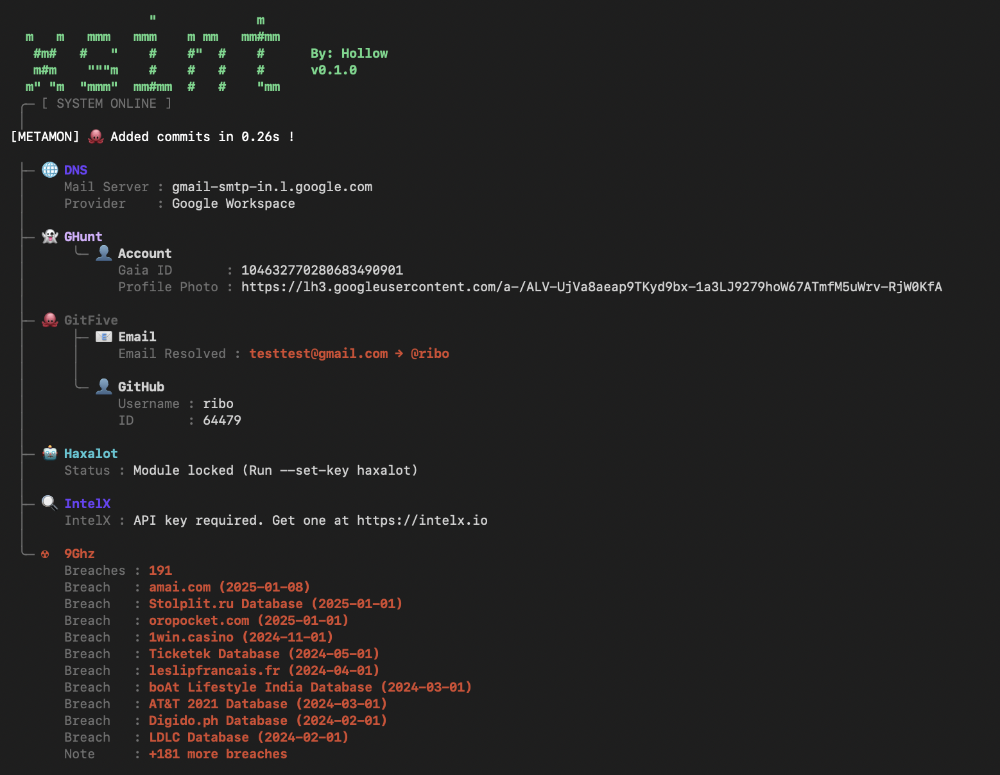

**XSINT** — a minimal OSINT tool.




## Example
```bash
                  "             m
  m   m   mmm   mmm    m mm   mm#mm
   #m#   #   "    #    #"  #    #      By: Hollow
   m#m    """m    #    #   #    #      v0.1.0
  m" "m  "mmm"  mm#mm  #   #    "mm
 ╭─ [ SYSTEM ONLINE ]
 │
[METAMON] 🐙 Added commits in 0.26s !

 ├─ 🌐 DNS
 │     Mail Server : gmail-smtp-in.l.google.com
 │     Provider    : Google Workspace
 │
 ├─ 👻 GHunt
 │      ╰─ 👤 Account
 │            Gaia ID       : 104632770280683490901
 │            Profile Photo : https://lh3.googleusercontent.com/a-/ALV-UjVa8aeap9TKyd9bx-1a3LJ9279hoW67ATmfM5uWrv-RjW0KfA
 │
 ├─ 🐙 GitFive
 │      ├─ 📧 Email
 │      │     Email Resolved : testtest@gmail.com → @ribo
 │      │
 │      ╰─ 👤 GitHub
 │            Username : ribo
 │            ID       : 64479
 │
 ├─ 🤖 Haxalot
 │     Status : Module locked (Run --set-key haxalot)
 │
 ├─ 🔍 IntelX
 │     IntelX : API key required. Get one at https://intelx.io
 │
 ╰─ ☢  9Ghz
       Breaches : 191
       Breach   : amai.com (2025-01-08)
       Breach   : Stolplit.ru Database (2025-01-01)
       Breach   : oropocket.com (2025-01-01)
       Breach   : 1win.casino (2024-11-01)
       Breach   : Ticketek Database (2024-05-01)
       Breach   : leslipfrancais.fr (2024-04-01)
       Breach   : boAt Lifestyle India Database (2024-03-01)
       Breach   : AT&T 2021 Database (2024-03-01)
       Breach   : Digido.ph Database (2024-02-01)
       Breach   : LDLC Database (2024-02-01)
       Note     : +181 more breaches

```


## Installation

### No installation
```bash
git clone https://github.com/memorypudding/xsint.git
cd xsint
python3 -m xsint
```

### pip (from source)

```bash
git clone https://github.com/memorypudding/xsint.git
cd xsint
pip install .
```

After installing, the `xsint` command is available globally:

```bash
xsint --help
usage: xsint [-h] [--list] [--list-modules [TYPE]] [--set-key ARGS [ARGS ...]] [--proxy URL] [--set-proxy URL] [target]

XSINT - OSINT Switchblade

positional arguments:
  target                Target to scan

options:
  -h, --help            show this help message and exit
  --list, -l            List supported input types and API key status
  --list-modules [TYPE]
                        List modules for an input type (e.g. --list-modules email)
  --set-key ARGS [ARGS ...]
                        Set an API key (e.g. 'hibp YOUR_KEY') or setup a module (e.g. 'haxalot')
  --proxy URL           Proxy URL (e.g. socks5://127.0.0.1:9050)
  --set-proxy URL       Save a default proxy URL

```

## Usage

```bash
xsint email:user@example.com
xsint phone:+14155551234
xsint user:johndoe
xsint ip:8.8.8.8
xsint "name:John Doe"
xsint "addr:Tokyo, Japan"
xsint hash:5f4dcc3b
xsint id:1234567890
xsint ssn:123-45-6789
xsint passport:AB1234567
```

Auto-detection works for emails, IPs, and phone numbers:

```bash
xsint user@example.com
xsint 8.8.8.8
xsint +14155551234
```

## API Keys

Some modules require API keys. Set them with:

```bash
xsint --set-key hibp YOUR_HIBP_KEY
xsint --set-key 9ghz YOUR_9GHZ_KEY
```

Check key status:

```bash
xsint --list
```

There is another module that requires login which is the haxalot bot on telegram
to set it run:
```bash
xsint --set-key haxalot
```

## Modules

Heres a list of all supported modules and inputs currently.

```bash
 xsint --list-modules

EMAIL 6/7 modules
  + email_basic: mx records
  + ghunt_lookup: gaia_id, profile, services, maps, calendar
  + gitfive_module: email, profile_info, ssh_keys
  + haxalot_module: breaches, passwords, pii
  x hibp: breaches, breach names, breach dates (requires hibp key)
  + intelx: breaches, leaks, pastes, documents
  + nineghz: breaches
PHONE 5/6 modules
  + ghunt_lookup: gaia_id, profile, services, maps, calendar
  + haxalot_module: breaches, passwords, pii
  x hibp: breaches, breach names, breach dates (requires hibp key)
  + intelx: breaches, leaks, pastes, documents
  + nineghz: breaches
  + phone_basic: formats, country, carrier, line type, timezone
USERNAME 4/5 modules
  + gitfive_module: email, profile_info, ssh_keys
  + haxalot_module: breaches, passwords, pii
  x hibp: breaches, breach names, breach dates (requires hibp key)
  + intelx: breaches, leaks, pastes, documents
  + nineghz: breaches
IP 3 modules
  + haxalot_module: breaches, passwords, pii
  + ip_basic: version, private/public
  + nineghz: breaches
HASH 2 modules
  + hibp: breaches, breach names, breach dates
  + nineghz: breaches
NAME 1 modules
  + nineghz: breaches
ID 1 modules
  + nineghz: breaches
SSN 1 modules
  + nineghz: breaches
PASSPORT 1 modules
  + nineghz: breaches
ADDRESS 1 modules
  + osm: address, coordinates, location type
```

Thanks to the creators of claude ai, opencode, mxrch(ghunt & gitfive), intelx, hibp, and nineghz for making this tool possible.
